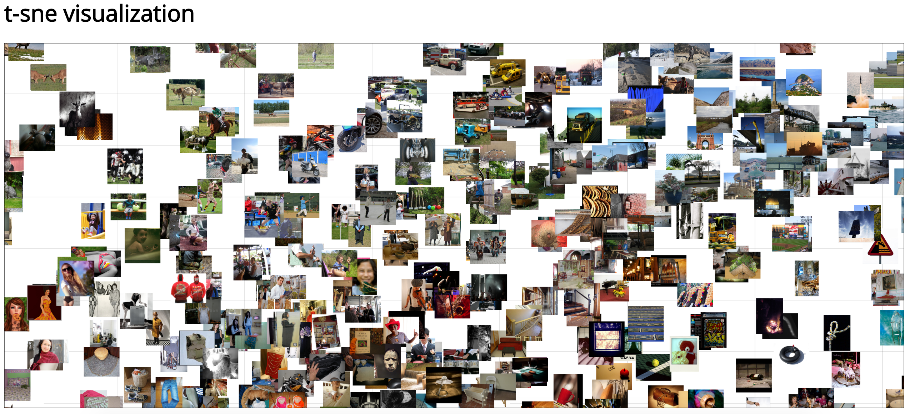

# tsne-d3-python
Visualize high dimensional data with t-sne using D3 and Python

## Requirements

```bash
pip install numpy
pip install tsne
pip install cherrypy
pip install jinja2
```

## Quick Demo

Run the following command to visualize a subset of ImageNet data (using VGGnet features):

```bash
python visualize_2d_data.npy --port 8080 --host 0.0.0.0 --data data_demo
```

Open your browser and go to `localhost:8080`. You should see your data visualized! Pan around by dragging with your mouse and zoom with your mouse's scroll wheel.

## Screenshot



## Instructions

### Setup

1. Put your images into the `public/data/` folder.
2. Create a text file `images_list.txt` somewhere that contains your images in each line. For instance, run `ls public/data/ | shuf > images_list.txt`.
3. Create a numpy file `data.npy` that contains an NxM array where N = number of images and each row corresponds to the image in `images_list.txt`, and M = number of features. For instance, extract CNN features for each image, put it into a numpy array and save to file:

```python
import numpy as np
# N = number of images, M = feature dimension
data = np.array((N, M))
# ... put features into data ...
np.save('data.npy', data)
```

### Preprocess with t-sne

First, preprocess your data with t-sne. This preprocessing step converts your high dimensional data into 2D via t-sne dimensionality reduction:

```bash
python preprocess_with_tsne.py /path/to/data.npy /path/to/images_list.txt
```

where

* `data.npy` is a numpy file with number of rows equal to the number of images and number of columns equals the number of features
* `images_list.txt` is a text file with each row containing the file name of the image corresponding to the row of the numpy array

After this preprocessing script is run, it should output `public/data.csv`. This is required for the visualization to work.

### Visualize

Next, visualize your preprocessed data via

```bash
python visualize_2d_data.py --port 8080 --host 0.0.0.0
```

Open your browser and go to `localhost:8080`. You should see your data visualized! Pan around by dragging with your mouse and zoom with your mouse's scroll wheel.
